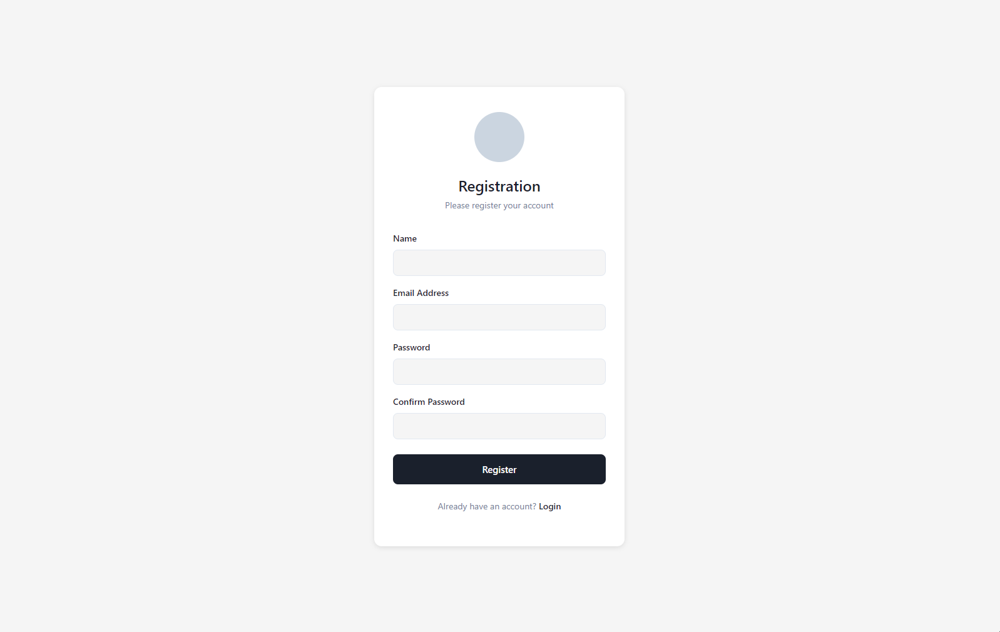
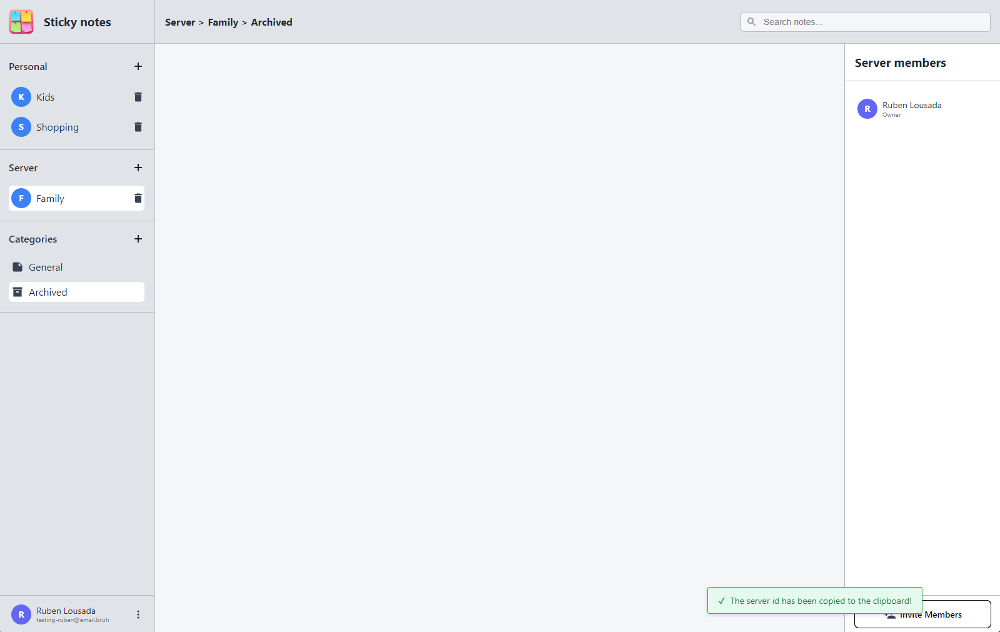

# Sticky notes application (Group 01)

## 1. Description
This project is a Sticky notes application for the "Desenvolvimento Web" course.
The application allows users to manage the sticky notes in the servers the user has joined, either personal server or not. It also allows owners of the server to manage the users that are connected to the it, allowing clearing all his notes and kicking him.
Each server has two categories by default (General & Archived) and it is possible to create even more.

## 2. Images

### Authentication

---

### Categories

---

### Notes

---

### Servers

---

### Notifications

## 3. Server instructions

### Requirements
+ Node.js
+ MongoDB + Command Line Database Tool

### Instructions

1. Navigate to the *backend* folder
2. Create data folder: `mkdir data`
3. Start mongod: `mongod --dbpath data --port 6000`
4. Restore mongodb dump: `mongorestore --port 6000 --db sticky-notes --drop ../mongodb-dump/sticky-notes`
5. Install dependencies: `npm install`
6. Start server: `node server.js`

This will initialize the server on port `5000`. 
The API will be exposed on `http://localhost:5000/api/`, while the SPA is on `http://localhost:5000/`.

## 4. Electron instructions

The Electron application is configured to automatically connect to the university server.

### Requirements
+ Node.js

### Instructions

1. Navigate to the root folder
2. Install electron: `npm install`
3. Run electron application: `npm start`

## 5. Existing accounts information

This is the data of the existing accounts in the mongodb dump...

### Accounts:
+ testing-ruben@email.bruh:testing-ruben@email.bruh
+ testing-vito@email.bruh:testing-vito@email.bruh

### Server of testing-ruben@email.bruh
694728e47ae856cc382308f1:123

## 6. Student Contributors

### Ruben
+ Convert Server to native http (instead of express) and fixed some bugs
+ Server also return HTML react project...
+ Develop website structure
+ Did most dialogs and menus
+ Created the services api calls
+ Handled Login, Register and communication with backend
+ Prepared electron to connect to server

### Vito
+ Server using express (Ruben mistakenly told him to do in express)
+ Partially design the website and color chossing
+ Created base dialog and did some dialogs
+ Improved menus css
+ Improved css
+ Added icon + favicon
+ Ask question in modal window to confirm when Kick user
+ Ask question in modal window to confirm when Clear notes
+ Change Name in modal window to change the inicial register Name and update changes without logout
+ Add new service api to update name
+ Correct bugs when open and not close menu options
